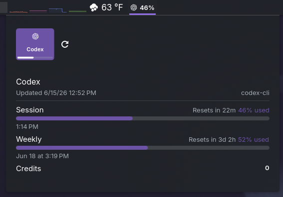

# KodexBar

> AI provider usage in your KDE Plasma panel.

[](https://kde.org/plasma-desktop/)
[](https://github.com/steipete/CodexBar)
[](LICENSE)

KodexBar is a native KDE Plasma widget inspired by [CodexBar](https://github.com/steipete/CodexBar). It keeps Codex, Claude, OpenAI, Gemini, Copilot, OpenRouter, Bedrock, GroqCloud, and other CodexBar-supported provider limits visible from a Plasma panel popup.

The widget intentionally uses the upstream `codexbar` CLI as its data source instead of reimplementing provider backends. CodexBar owns auth, provider config, API calls, local CLI probing, and `~/.codexbar/config.json`; KodexBar focuses on the Plasma panel and popup UI.



## Why

- **Panel visibility.** Show the active provider, used percent, and remaining credits directly in your KDE panel.
- **CodexBar-compatible data.** Reads the same JSON payloads as the upstream app and Linux CLI.
- **Provider fallback.** `Best available` tries Linux-friendly source combinations before surfacing an error.
- **Plasma-native UI.** Built as a Plasma 6 applet with Kirigami styling, provider icons, compact panel text, and a scrollable popup.

## Requirements

- KDE Plasma 6
- `kpackagetool6`
- Upstream `codexbar` CLI on `PATH`, or a full path configured in the widget settings

Install the upstream CLI with Homebrew on Linux:

```sh
brew install steipete/tap/codexbar
codexbar --version
codexbar usage --format json --pretty
```

Or download a Linux CLI tarball from the [CodexBar releases](https://github.com/steipete/CodexBar/releases/latest).

Make sure the provider CLIs or credentials you rely on are already configured. For example, sign in with `codex login`, `claude /login`, cloud/provider CLIs, or API keys supported by CodexBar.

## Install

Clone this repository and install the applet:

```sh
git clone https://github.com/tylxr59/KodexBar.git
cd KodexBar
kpackagetool6 -t Plasma/Applet -i .
```

Then add **KodexBar** to a Plasma panel.

For development reloads:

```sh
kpackagetool6 -t Plasma/Applet -u .
plasmashell --replace
```

## Usage

- Click the panel item to open the popup.
- Use the refresh button in the popup to query the CLI immediately.
- Open widget settings to change provider, source, refresh cadence, and compact label fields.
- Leave Provider as `Best available` if you want KodexBar to find the first usable Linux-capable provider/source combination.
- Choose `All enabled` to ask the CLI for all providers enabled in `~/.codexbar/config.json`.

The popup renders common CodexBar CLI fields:

- session, weekly, tertiary, and extra rate-limit windows
- reset countdowns and usage bars
- provider spend/budget rows
- credit balances
- OpenAI dashboard summaries where present
- provider status when status fetching is enabled
- per-provider CLI/runtime errors

Provider-specific charts, account management, cookie/API-key editing, notifications, and cost scans remain available through the upstream CodexBar app and CLI.

## Settings

KodexBar exposes these Plasma widget settings:

| Setting | Purpose |
| --- | --- |
| Command | `codexbar` binary name or full path. |
| Provider | `Best available`, `All enabled`, or a specific CodexBar provider ID. |
| Source | `Best available`, `auto`, `web`, `cli`, `oauth`, or `api`. |
| Refresh | Poll interval, from 10 to 3600 seconds. |
| Show provider in panel | Include the provider name in the compact label. |
| Show used percent in panel | Include primary window usage in the compact label. |
| Show credits in panel | Include remaining credits in the compact label when available. |
| Show email in widget | Show the account email inside the popup when available. |
| Fetch provider status | Add `--status` to CLI calls and display incident/maintenance state. |

Provider credentials and provider toggles are still controlled by the CodexBar CLI config at `~/.codexbar/config.json`.

## Linux provider fallback

Some CodexBar sources are macOS-specific, especially WebKit/browser integrations from the upstream app. KodexBar's `Best available` mode first lets the CLI use its configured defaults, then falls back through Linux-friendly combinations such as:

- Codex via CLI, OAuth, or API
- Claude via CLI, OAuth, or API
- OpenAI, Gemini, Copilot, Kilo, Kimi, z.ai, MiniMax, Vertex AI, Warp, OpenRouter, ElevenLabs, Ollama, DeepSeek, Bedrock, GroqCloud, LLM Proxy, Deepgram, and other API/CLI-backed providers

If you already know which provider works on your system, select it directly and leave Source as `Auto` or `Best available`.

## Test The CLI

Run these before debugging the widget:

```sh
codexbar usage --format json --json-only --provider all --source auto | python3 -m json.tool
codexbar usage --format json --json-only --provider codex --source oauth | python3 -m json.tool
```

If the widget shows a CLI error, either install the CLI, configure provider credentials, or set the full command path in the widget settings.

## How It Works

1. Plasma runs the applet from `metadata.json` and `contents/ui/main.qml`.
2. The applet shells out to `codexbar usage --format json --json-only`.
3. The JSON payload is normalized into provider cards, usage rows, credit rows, status text, and compact panel text.
4. A timer refreshes the data at the configured interval.
5. Provider icons are loaded from `contents/icons/providers/`.

## Troubleshooting

| Symptom | Likely fix |
| --- | --- |
| Widget says `No data` | Run `codexbar usage --format json --pretty` in a terminal and verify the CLI returns usable data. |
| Widget shows a CLI/runtime error | Install `codexbar`, set the full command path, or select a provider/source that works on Linux. |
| Provider works in terminal but not in the widget | Use an absolute command path in settings if Plasma does not inherit your shell `PATH`. |
| `Best available` picks the wrong provider | Select the provider explicitly in settings. |
| Status never appears | Enable **Fetch provider status** in widget settings. |

## License

MIT. See [LICENSE](LICENSE).
